# Let's create your PIRs with Anomali ThreatStream Next-Gen
Priority Intelligence Requirements (PIRs) serve as the strategic foundation of any effective CTI program, ensuring that analyst effort and collection resources are directed toward the threats that matter most to the organization. Without clearly defined PIRs, security teams risk producing generic, unfocused intelligence that fails to inform real decision-making across SOC, IR, and executive stakeholders.
 

The article here is a quick guide how you can implement your PIRs with ThreatStream Next-Gen - Let’s get started!
 

## Create your priority intelligence questions list
First of all, you need to create a priority intelligence questions list tailored with your intelligence requirements. Hit *Reporting* on the left pane.
 

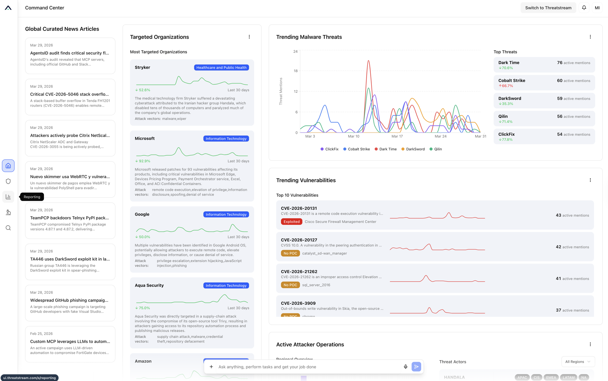

 
 

Hit *Template Management* tab on the top left, and hit *New Template* on the top right. Put an appropriate template name on the *Template Name* box, and put an appropriate description on the *Description* box. Define the report section and put those on *Sections* box, and hit *Create Template*.
 

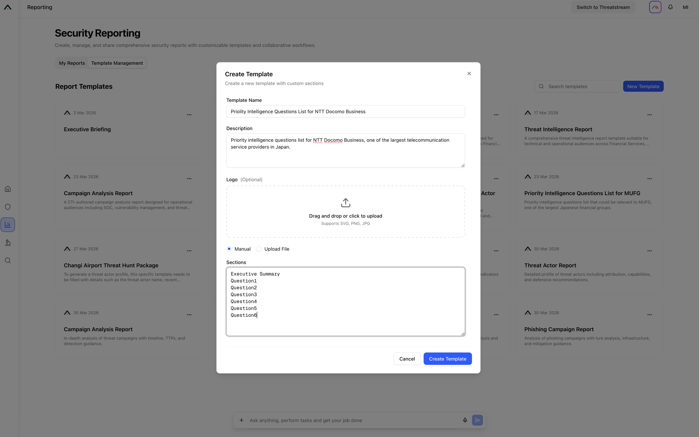

 
 

After successful creation, you may see your reporting template. Let’s ask Copilot to create a priority intelligence questions list for you. Here comes a sample prompt for Copilot.
> Can you create the latest priority intelligence questions list for NTT Docomo Business?
 

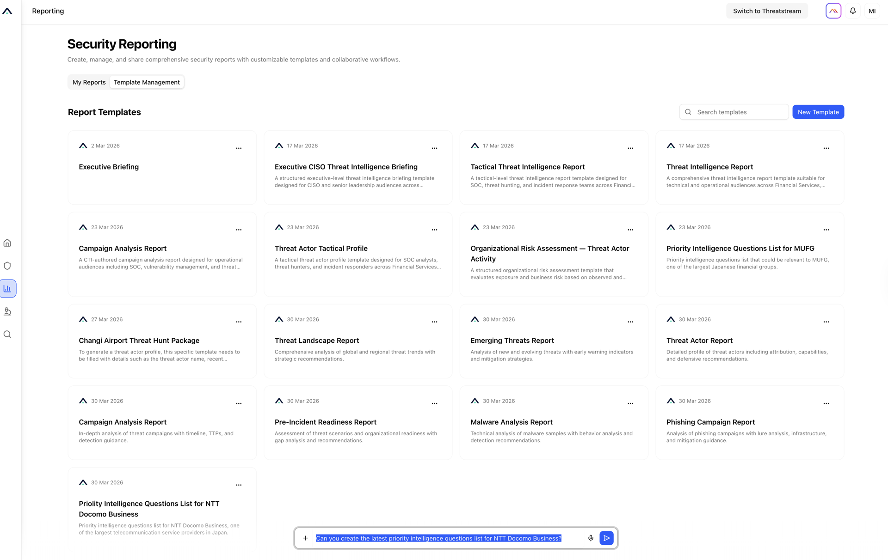

 
 

Copilot is going to create a PIQ list, and it might ask you which reporting template you want to use. Tell the template name that you just created to Copilot.
 

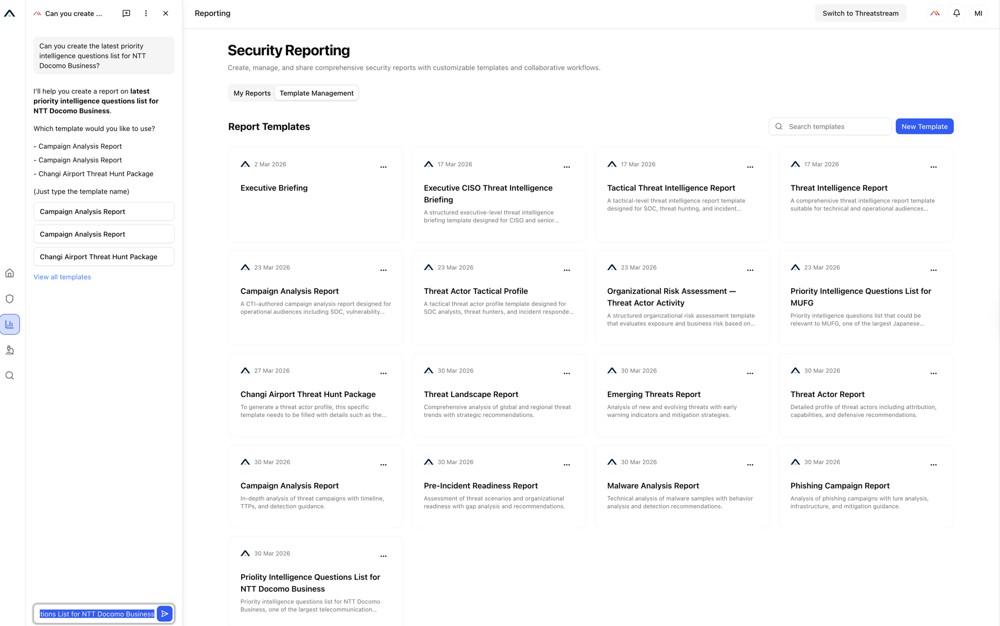

 
 

In some minutes, a tailored priority intelligence questions list is going to be created. Now, you’re ready to create your PIRs. Let’s grab one of the questions that you just created.
 

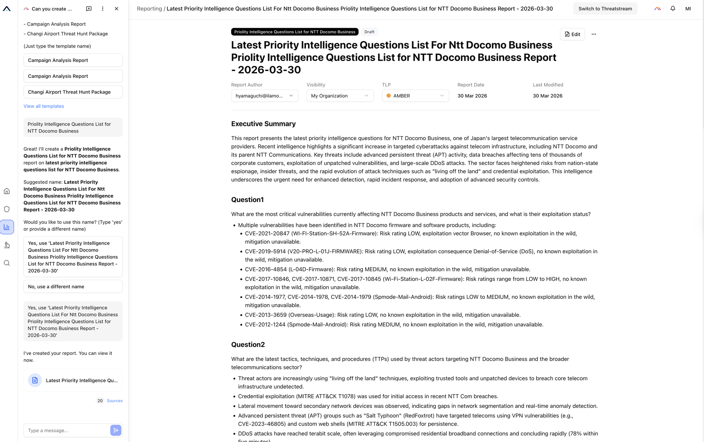

 
 

Hit *Priority Intelligence Requirements* on the left pane, and hit *New PIR* on the top right.
 

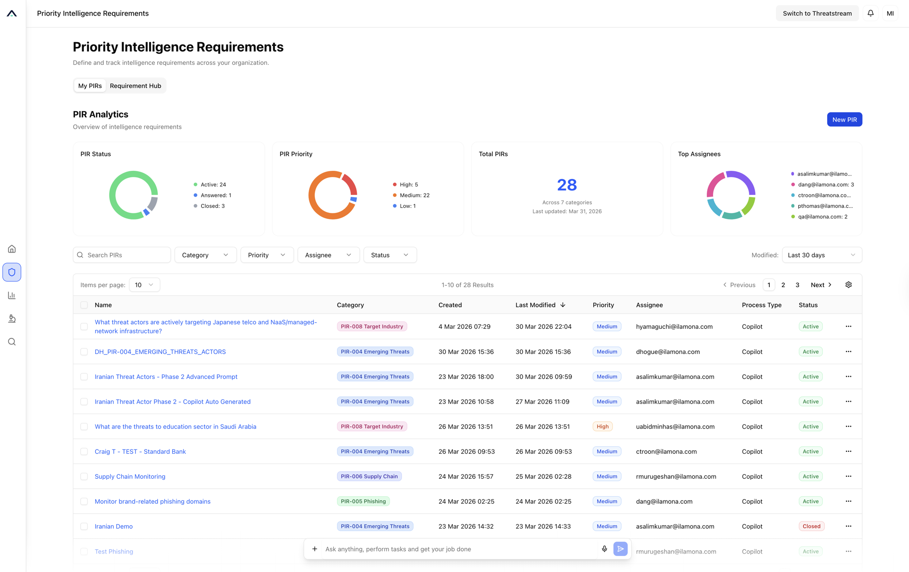

 
 

Paste the priority intelligence question that you just grabbed on the *Description* box, and put an appropriate name on the *Name* box. Select appropriate *Category*, and specify *Stakeholders*, *Assignee* and *Priority*. Hit *Next*.
 

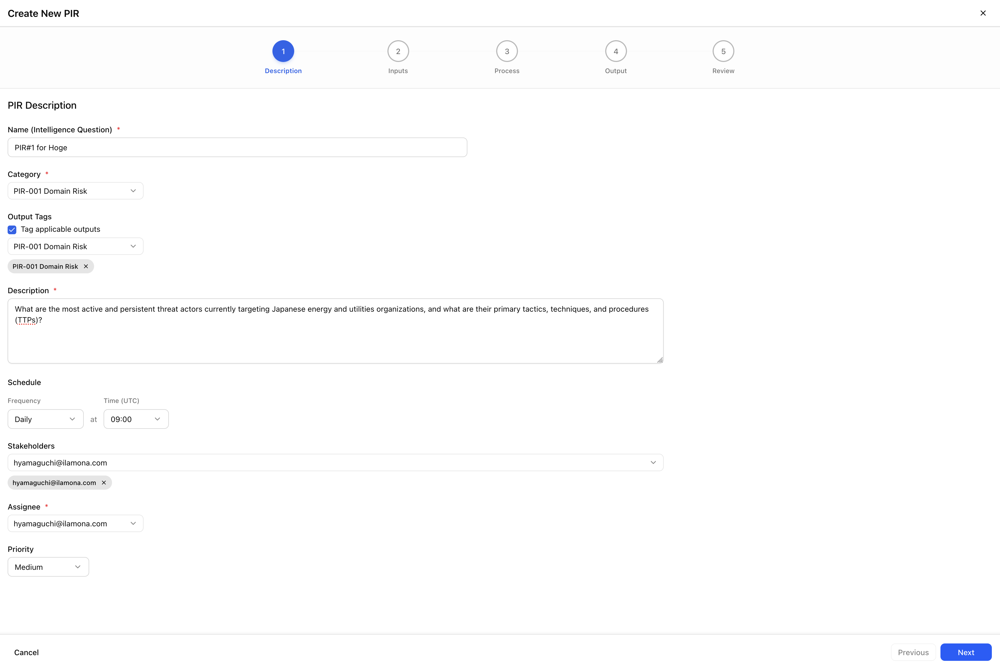

 
 

Copilot is going to analyze the contents that you just created on the privious screen, and going to associate relevant IoCs, Threat Models and Investigations to the PIR. Select any associations that you need to associate. Also, copilot is going to give you recommended tags and key words for the filtering. Select appropriat tags and key words so you can manage the PIR efficiently. Hit *Next*.
 

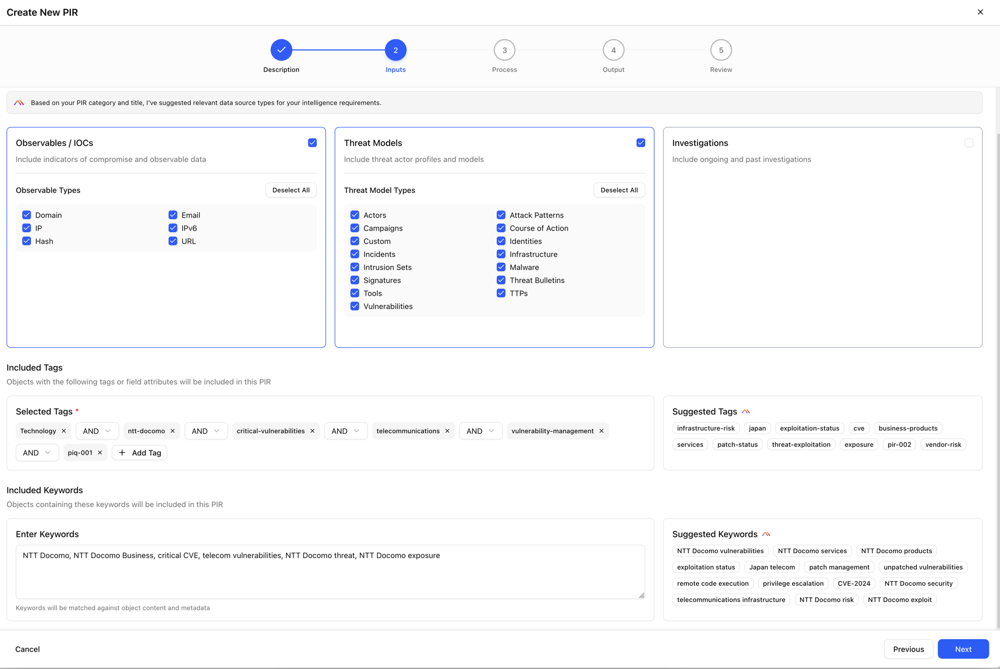

 
 

If you hit *Generate Analytics Process*, Copilot is going to analyze the contents that you just created on the previous screens, and create a suitable analytics process for the PIR. Hit it and *Next*.
 

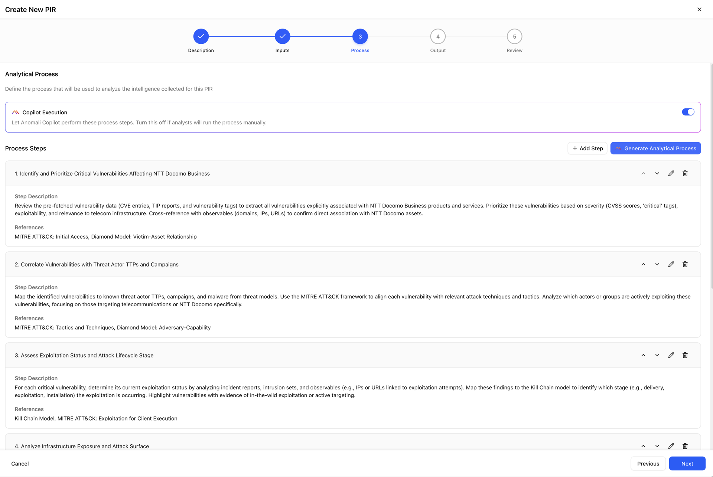

 
 

You can also select output channels for the PIR. Let’s select *Email* for now, and specify a receiver. Hit *Next*.
 

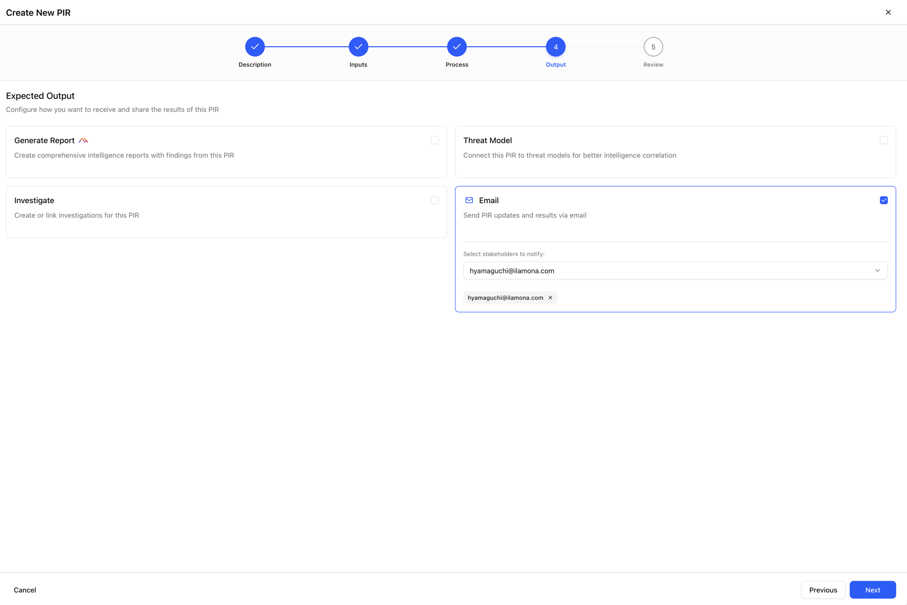

 
 

If all settings are ok, you should hit *Create PIR*.
 

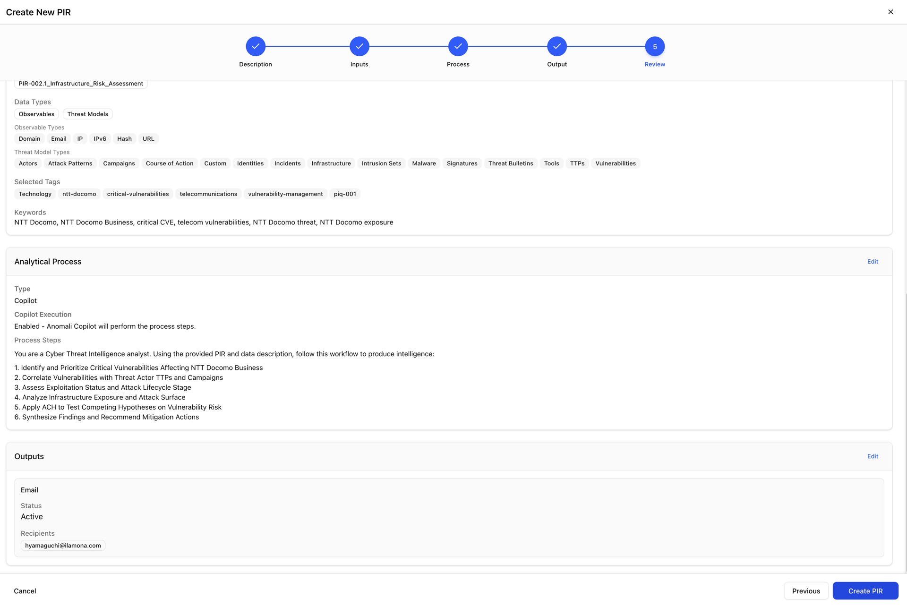

 
 

The PIR is created. The output is going to be emailed to the specified receiver with the defined cadence.
 

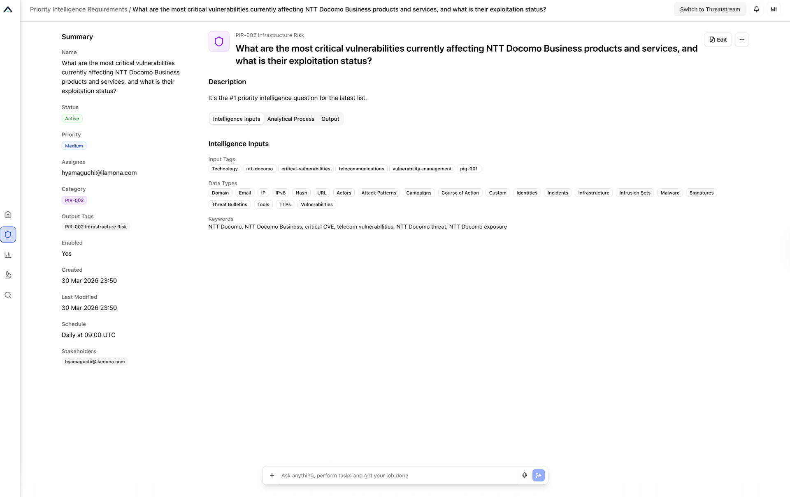

 
 
 
 

Hope the article is beneficial for you. If you have found a bug or if you have updates request, please create *Issues* - I'll follow-up accordingly.
